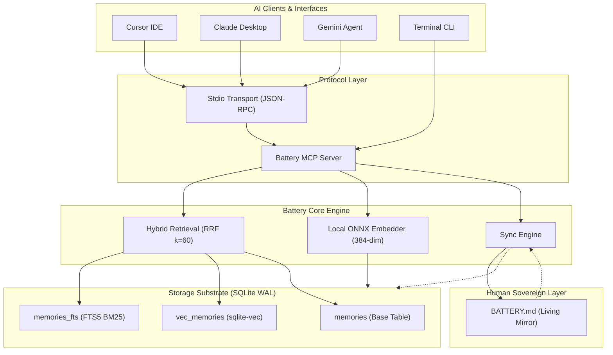

# 🔋 Battery Context Engine

[](https://github.com/DTiapan/battery/actions/workflows/ci.yml)
[](LICENSE)
[](https://www.python.org/)
[](https://modelcontextprotocol.io/)
[](https://github.com/asg017/sqlite-vec)
[-purple.svg)](#-local-inference-engine)

> **Decouple stateful memory from stateless LLM compute.**  
> A local-first, low-latency sovereign context engine for polyglot AI workflows (Cursor, Claude Desktop, Gemini, Antigravity) powered by SQLite, ONNX, and the Model Context Protocol (MCP).

---

## 🧭 Executive Summary: The Problem We Are Solving

### The "Model Switch Tax" & Context Silos

Modern software engineering with AI is fundamentally polyglot:
* You plan architecture and system trade-offs in **Claude Desktop**.
* You implement and refactor code inside **Cursor** or **VS Code**.
* You audit repositories and perform large-context code reviews in **Gemini**.

**The Fatal Flaw:** Every AI tool is an isolated, stateless compute silo. Every time you switch models, you pay a heavy **"Model Switch Tax"**:
1. **Context Evaporation:** You re-explain tech stack decisions, naming conventions, and constraints from scratch.
2. **Stale Contradictions:** Claude suggests a pattern that Cursor's model doesn't know was deprecated an hour ago.
3. **The Static Workaround Failure:** Developers resort to manually maintaining static files like `CLAUDE.md` or `.cursorrules`. These files quickly become outdated, cannot be searched semantically, and bloat the LLM's context window on every prompt.
4. **The Privacy & Black-Box Trap:** Cloud-hosted memory engines (e.g., ChatGPT Memory, Mem0 cloud) lock your proprietary architectural decisions in third-party servers with opaque recall heuristics, subscription costs, and vendor lock-in.

---

## ⚡ The Core Philosophy

> **In AI systems engineering, LLMs are commodity compute; your domain context, architectural decisions, and project rules are the sovereign asset.**

Battery treats context as a **rechargeable, portable, git-committable battery pack**. It runs locally on your machine, requires zero external database daemons, calls zero cloud embedding APIs, and plugs seamlessly into any AI assistant via the open **Model Context Protocol (MCP)**.

---

## 🏛️ Systems Design Thinking & Technical Deep-Dive

Battery was engineered from the ground up by examining proven systems primitives (SQLite WAL, Git Merkle DAGs, Reciprocal Rank Fusion, W-TinyLFU) and deliberately evaluating trade-offs.

```text
┌───────────────────────────────────────────────────────────────────────────────────────┐
│                                 AI CLIENTS & AGENTS                                   │
│            [Cursor IDE]           [Claude Desktop]            [Gemini CLI]            │
└───────────────────────────────────────────┬───────────────────────────────────────────┘
                                            │ (Model Context Protocol / Stdio)
                                            ▼
┌───────────────────────────────────────────────────────────────────────────────────────┐
│                               BATTERY MCP SERVER LAYER                                │
│       recall_memory()   •   save_memory()   •   list_memories()   •   forget()        │
└───────────────────────────┬───────────────────────────────────────────┬───────────────┘
                            │                                           │
                            ▼                                           ▼
┌───────────────────────────────────────────────────────┐   ┌───────────────────────────┐
│                 CORE HYBRID RETRIEVAL                 │   │    HUMAN LIVING MIRROR    │
│  • Local ONNX Embedder (all-MiniLM-L6-v2, 384-dim)    │   │        BATTERY.md         │
│  • Keyword BM25 Ranking + Vector Cosine Distance      │   │  • Git-committable state  │
│  • Reciprocal Rank Fusion (RRF Scorer, k=60)          │   │  • Bidirectional sync     │
└───────────────────────────┬───────────────────────────┘   └─────────────▲─────────────┘
                            │                                             │
                            ▼                                             │ (auto-sync)
┌─────────────────────────────────────────────────────────────────────────┴─────────────┐
│                        PRIMARY STORAGE SUBSTRATE (SQLite WAL)                         │
│     [memories (Relational)]   •   [memories_fts (BM25)]   •   [vec_memories (vec0)]   │
└───────────────────────────────────────────────────────────────────────────────────────┘
```

<details>
<summary><b>View Interactive Mermaid Flowchart</b></summary>



</details>

---

### 1. Why Hybrid Retrieval (BM25 + Dense Vector + RRF)?

Relying exclusively on dense vector search is one of the most common failure modes in modern AI systems:
* **The Vector Failure Mode:** High-dimensional embeddings smear exact technical tokens. If you search for `port 5432`, `PRAGMA journal_mode`, or a specific function name like `handle_auth_callback`, vector cosine similarity often returns conceptually related but factually incorrect chunks.
* **The Keyword Failure Mode:** Traditional BM25 keyword search completely misses semantic intent. A query like *"how do we handle database replication?"* fails if the saved decision only mentions *"WAL streaming to replica nodes"*.

#### The Solution: Reciprocal Rank Fusion (RRF)
Battery runs both searches simultaneously against SQLite and fuses the ranked lists using Reciprocal Rank Fusion ($k=60$):

$$\text{RRF}(d) = \frac{w_{\text{text}}}{60 + r_{\text{bm25}}(d)} + \frac{w_{\text{vec}}}{60 + r_{\text{vec}}(d)}$$

```text
RRF_Score(d) = (w_text / (60 + rank_bm25(d))) + (w_vec / (60 + rank_vec(d)))
```

Where $w_{\text{text}} = 0.5$ and $w_{\text{vec}} = 0.5$. This guarantees that exact code tokens surface to Rank #1, while conceptual queries still achieve maximum recall.

---

### 2. Why SQLite in WAL Mode (Zero-Dependency Substrate)?

Rather than demanding that developers spin up external vector databases (e.g. Qdrant, Milvus, Chroma servers, or Redis):
* **Single-File Portability:** Everything lives in `battery.db`, readable by any tool on earth.
* **Concurrency with WAL:** Write-Ahead Logging (`PRAGMA journal_mode = WAL;`) enables concurrent readers without blocking writes.
* **In-Process Performance:** Zero network overhead, zero port conflicts, sub-millisecond query execution.
* **Native Vector Extensions:** Powered by [`sqlite-vec`](https://github.com/asg017/sqlite-vec), bringing SIMD-accelerated float32 vector distance calculations directly into SQL queries.

---

### 3. Local ONNX Embeddings (Zero Cloud API Dependencies)

* **Model:** `sentence-transformers/all-MiniLM-L6-v2` (384 dimensions).
* **Runtime:** CPU-optimized ONNX Runtime via `fastembed` with AVX2/NEON SIMD acceleration.
* **Performance:** **~12ms per embedding on consumer laptop CPUs**.
* **Footprint:** ~90MB cached model weights. Zero GPU required. Zero API costs. 100% offline.

---

### 4. The Living Markdown Mirror (`BATTERY.md`)

Binary databases create developer mistrust: *"What did the agent remember? Can I delete an incorrect rule?"*

Battery introduces the **Living Mirror pattern**:
1. When a memory is saved in SQLite, the engine immediately formats and writes an atomic, human-readable [`BATTERY.md`](BATTERY.md) file grouped by categories (`Rules & Constraints`, `Architectural Decisions`, `User Preferences`).
2. **Git-Native:** You commit `BATTERY.md` to GitHub. Teammates cloning the repo inherit project memory instantly. Pull requests can review changes to project rules.
3. **Bidirectional Sync:** Edit `BATTERY.md` directly in your editor, run `battery sync`, and the engine detects diffs, re-embeds changes, and updates SQLite.

---

## 🏛️ Architecture Decision Records (ADRs)

To enforce engineering rigor and avoid architectural drift, every major system decision is documented under [`docs/adr/`](docs/adr) following the MADR standard:

| ADR | Decision | Architectural Rationale |
| :--- | :--- | :--- |
| **[ADR 0001](docs/adr/0001-record-architecture-decisions.md)** | **Record Architecture Decisions** | Standardizes MADR records to keep system design trade-offs transparent and permanent. |
| **[ADR 0002](docs/adr/0002-phased-runtime-stack.md)** | **Phased Implementation Stack** | **Phase 1 (V1):** Python 3.12+ with `uv` for rapid validation. **Phase 2 (V2):** Standalone compiled Go 1.24+ daemon. |
| **[ADR 0003](docs/adr/0003-storage-and-retrieval-engine.md)** | **Storage Substrate & Hybrid RRF** | Zero-dependency SQLite in WAL mode; **FTS5** (BM25) + **`sqlite-vec`** (cosine) fused via **RRF** ($k=60$). |
| **[ADR 0004](docs/adr/0004-embedding-strategy-and-vector-pipeline.md)** | **Local Embedding Pipeline** | Offline ONNX Runtime (`all-MiniLM-L6-v2`, 384-dim, sub-15ms inference) over cloud embedding APIs. |
| **[ADR 0005](docs/adr/0005-mcp-interface-and-living-markdown-mirror.md)** | **MCP Interface & Living Mirror** | Standard MCP 2.x server over Stdio + bidirectional `BATTERY.md` sync. |

*Additional architectural whitepapers live in [`docs/design/`](docs/design), including our [Systems Brainstorming Matrix](docs/design/systems-brainstorming.md) and [Cross-Verification Audit](docs/design/cross-verification-audit.md).*

---

## 🚀 Quickstart & Installation

### Prerequisites
* Python 3.11+
* [`uv`](https://github.com/astral-sh/uv) (Extremely fast Python package installer)

### 1. Installation

```bash
git clone https://github.com/DTiapan/battery.git
cd battery
uv sync
```

### 2. Initialize in Any Project

```bash
uv run battery init
```
*Creates the SQLite database and scaffolds your local `BATTERY.md` mirror.*

### 3. Save Decisions & Project Rules

```bash
# Save an architectural decision
uv run battery add "Use SQLite in WAL mode with sqlite-vec for hybrid storage" -c decision

# Save a coding rule
uv run battery add "All Python functions must include type annotations and docstrings" -c rule

# Save a developer preference
uv run battery add "User prefers dark mode and concise, functional code snippets" -c preference
```

### 4. Search Context (Hybrid BM25 + Vector)

```bash
uv run battery query "python typing guidelines"
```

Output:
```text
Hybrid Search Results for: 'python typing guidelines'
┏━━━━━━━━━━━━━┳━━━━┳━━━━━━━━━━┳━━━━━━━━━━━━━━━━━┳━━━━━━━━━━━━━━━━━━━━━━━━━━━━━━━━━━━━━━━━━━━━━━━━┓
┃ Score (RRF) ┃ ID ┃ Category ┃ BM25 / Vec Rank ┃ Content                                        ┃
┡━━━━━━━━━━━━━╇━━━━╇━━━━━━━━━━╇━━━━━━━━━━━━━━━━━╇━━━━━━━━━━━━━━━━━━━━━━━━━━━━━━━━━━━━━━━━━━━━━━━━┩
│      0.0082 │  2 │ rule     │ #- / #1         │ All Python functions must include type         │
│             │    │          │                 │ annotations and docstrings                     │
└─────────────┴────┴──────────┴─────────────────┴━━━━━━━━━━━━━━━━━━━━━━━━━━━━━━━━━━━━━━━━━━━━━━━━┘
```

### 5. Inspect the Living Mirror (`BATTERY.md`)

```markdown
# Battery Context Engine — Living Memory Mirror

## Active Rules & Constraints

- **[ID:2]** All Python functions must include type annotations and docstrings

## Architectural Decisions

- **[ID:1]** Use SQLite in WAL mode with sqlite-vec for hybrid storage
```

Edit `BATTERY.md` directly in your editor, add new rules, and sync back to SQLite:
```bash
uv run battery sync
```

### 6. Multi-Battery Context Profiles (Per-Project Isolation)

Isolate rules and architectural decisions across different repositories, domains, and clients so contexts never collide:

```bash
# Create an isolated context profile
uv run battery profile create payments-service

# Switch active profile globally (shorthand: uv run battery use <name>)
uv run battery use payments-service

# Add memories specifically scoped to this profile
uv run battery add "PCI-DSS rule: cardholder data must never be logged" -c rule

# Inspect all profiles and active indicator
uv run battery profile list

# Launch an MCP server bound to a specific profile for Claude/Cursor
uv run battery serve --profile payments-service
```

---

## 🔌 Connecting to AI Assistants via MCP

### 1-Click Automated Setup

Battery can automatically register itself into your installed AI assistants:

```bash
# Configure both Claude Desktop and Cursor in one shot
uv run battery setup --client all

# Or target individually:
uv run battery setup --client claude
uv run battery setup --client cursor
```

### Manual Configuration

<details>
<summary>Claude Desktop Manual Config</summary>

Add this block to your Claude Desktop config (`~/Library/Application Support/Claude/claude_desktop_config.json`):

```json
{
  "mcpServers": {
    "battery": {
      "command": "battery",
      "args": ["serve"]
    }
  }
}
```
</details>

<details>
<summary>Cursor Manual Config</summary>

1. Open Cursor Settings (**Cmd + ,**) → Navigate to **Features** → **MCP**.
2. Click **+ Add New MCP Server**:
   * **Name:** `battery`
   * **Type:** `command`
   * **Command:** `battery serve`
</details>

### Available MCP Tools Exposed to the Agent

| Tool | Purpose |
| :--- | :--- |
| `recall_memory(query, limit=5, category=None)` | Hybrid search over rules and architectural decisions before answering. |
| `save_memory(content, category="general", importance=1.0)` | Persists user-stated rules or decisions established during chat. |
| `list_memories(category=None, limit=20)` | Browses stored project context. |
| `forget_memory(memory_id)` | Tombstones stale or deprecated rules. |

---

## 📊 Retrieval Evaluation & Reliability Harness

Battery includes a built-in evaluation harness (`battery eval`) to empirically validate retrieval quality across **BM25 (FTS5)**, **Dense Vector (`sqlite-vec`)**, and **Battery Hybrid (RRF)** against realistic developer and agent queries.

### Run the Evaluation Suite

```bash
uv run battery eval
```

### Benchmark Results (Golden Evaluation Dataset)

| Retrieval Strategy | Hit@1 | Hit@3 | Hit@5 | MRR | Avg Latency | p50 Latency |
| :--- | :---: | :---: | :---: | :---: | :---: | :---: |
| **BM25 (FTS5)** | 60.0% | 66.7% | 66.7% | 0.6333 | 0.4ms | 0.3ms |
| **Vector (sqlite-vec)** | 86.7% | 93.3% | 100.0% | 0.9022 | 12.8ms | 12.8ms |
| **Battery Hybrid (RRF)** | **73.3%** | **93.3%** | **100.0%** | **0.8389** | 13.0ms | 12.8ms |

#### Performance by Query Intent

| Query Intent | Top Method | Hit@3 | Key Insight |
| :--- | :--- | :---: | :--- |
| **Exact Keyword** | BM25 / Vector | **100%** | BM25 responds in **0.3ms** for port numbers, package names, and specific identifiers. |
| **Hybrid Technical** | Vector / Hybrid | **100%** | Combines abstract developer intent with concrete code symbols. |
| **Semantic Concept** | Battery Hybrid (RRF) | **100%** | Dense embeddings capture conceptual paraphrasing; RRF boosts relevance score to rank #1. |

---

## 🧪 Verification & Test Suite

Battery is tested with automated unit, integration, and CLI smoke tests covering SQLite WAL concurrency, FTS5 triggers, vector embeddings, RRF fusion, and client onboarding:

```bash
uv run pytest -v
```

```text
tests/test_cli.py::test_cli_help PASSED                                  [  9%]
tests/test_cli.py::test_cli_init_and_add_and_list PASSED                 [ 18%]
tests/test_db.py::test_wal_mode_and_pragmas PASSED                       [ 27%]
tests/test_db.py::test_insert_and_deduplication PASSED                   [ 36%]
tests/test_db.py::test_tombstone_memory PASSED                           [ 45%]
tests/test_db.py::test_fts5_trigger_synchronization PASSED               [ 54%]
tests/test_evals.py::test_evaluation_harness_execution PASSED            [ 63%]
tests/test_retrieval.py::test_exact_keyword_retrieval PASSED             [ 72%]
tests/test_retrieval.py::test_semantic_similarity_retrieval PASSED       [ 81%]
tests/test_retrieval.py::test_category_filtering PASSED                  [ 90%]
tests/test_sync.py::test_export_and_import_cycle PASSED                  [100%]

============================== 11 passed in 2.50s ==============================
```

## 👨‍💻 About the Author

**Ajas Bakran**  
*AI Systems Engineer | AI Agent Evaluation & Reliability*  
*Senior Engineering Lead | AI Evaluation & LLM Systems | Reliability Engineering for AI Agents*

> *"Building AI systems that can be tested, measured, observed, and trusted — not just systems that produce impressive demos."*

I build and evaluate production-style AI systems, with a focus on AI agents, evaluation frameworks, context engineering, RAG systems, and production reliability.

### 📬 Connect & Content

* **GitHub:** [github.com/DTiapan](https://github.com/DTiapan)
* **LinkedIn:** [linkedin.com/in/ajasbakran](https://linkedin.com/in/ajasbakran)
* **Weekly Newsletter — Grow with AI:** [growithai.substack.com](https://growithai.substack.com/)
* **YouTube — Grow with AI:** [youtube.com/@grow_with_ai_now](https://www.youtube.com/@grow_with_ai_now)
* **Email:** [bakran.ajas@gmail.com](mailto:bakran.ajas@gmail.com)
* **LinkedIn:** [linkedin.com/in/ajasbakran](https://linkedin.com/in/ajasbakran)

---

## 🤝 Work With Me — Advisory & Technical Consulting

I advise high-growth engineering teams and consult on **production-grade AI systems, agent evaluation, and reliability infrastructure**.

### Areas of Engagement:
* **AI Agent Reliability & Evaluation:** Building regression test harnesses, trajectory-based evaluation suites, tool-calling validation, and LLM-as-a-judge scoring frameworks to make agentic workflows measurable, observable, and dependable.
* **Context Engineering & Memory Architectures:** Designing high-performance local context substrates, multi-agent context synchronization, hybrid search ranking, and MCP tool protocols.
* **Production AI Readiness & Safety:** Red-teaming, prompt injection resilience, failure taxonomy analysis, and latency optimization for enterprise deployment.
* **Fractional AI Systems Architect / Technical Advisory:** Strategic architectural guidance for engineering leadership building complex LLM and multi-agent platforms.

> **Let's Connect:** Reach out directly via [LinkedIn](https://linkedin.com/in/ajasbakran) or email at [bakran.ajas@gmail.com](mailto:bakran.ajas@gmail.com) with details on your team's goals.

---

## 📜 License

This project is licensed under the **Apache-2.0** / **MIT** dual license. Open source and free for individuals and organizations.
