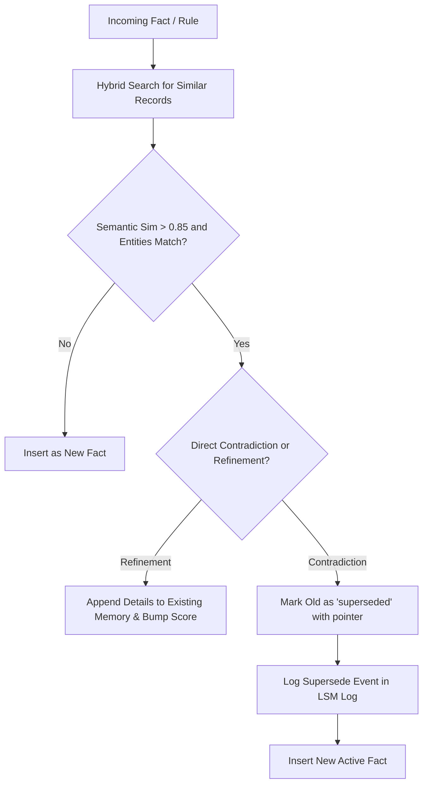

# System Design: Swappable Context Engine ("Battery-Pack Memory")

> **Core Thesis:** Decouple stateful memory from stateless LLM compute. Just as an electric vehicle swaps standardized battery packs across motors, an AI workflow should swap local, sovereign context packs across any intelligence engine (Claude, Gemini, ChatGPT, local LLMs) via the Model Context Protocol (MCP).

---

## 1. Academic Foundations & Research Paper Mapping

Rather than creating an ad-hoc heuristic, the architecture is grounded in five key research papers from 2024–2026:

```
┌──────────────────────────────────────────────────────────────────────────────────┐
│                             Academic Foundations                                 │
│                                                                                  │
│  [Portable Agent Memory]       [MemGPT / Letta]            [MemCon]              │
│  arXiv:2605.05047              Packer et al.               arXiv:2607.13591      │
│  ├── Cross-LLM Serialization   ├── Tiered Virtual Memory   ├── Adaptive Policy   │
│  ├── Episodic/Semantic Typing  ├── Paging to Archival DB   ├── Pruning & Eviction│
│  └── Cryptographic Provenance  └── Working Context Limits  └── Memory Budgeting  │
│                                                                                  │
│  [Latent Context Compilation]  [MILES Architecture]        [Swiss Tables / SIMD] │
│  arXiv:2602.21221              arXiv:2607.06974            Go 1.24 / Abseil      │
│  └── Plug-and-play buffers     └── Modular unit selection  └── Sub-10ns hot map  │
└──────────────────────────────────────────────────────────────────────────────────┘
```

### 1. *Portable Agent Memory: A Protocol for Provenance-Verified Memory Transfer Across Heterogeneous LLM Agents* (arXiv:2605.05047)
* **Problem Addressed:** Memory representations formatted for one model fail or degrade when directly injected into another due to tokenizer mismatch, prompt drift, and hallucinated memory provenance.
* **What We Borrow:**
  * **Three-Tier Memory Typing:** 
    1. *Episodic Memory:* Time-stamped event summaries (*"On Sept 9, user chose Go over Rust for the CLI"*).
    2. *Semantic Memory:* Persistent facts, domain invariants, and world knowledge (*"The database schema uses strict foreign keys"*).
    3. *Procedural Memory:* Style rules, workflows, and response constraints (*"Always output code with type annotations and no comments"*).
  * **Model-Agnostic Canonical Envelope:** Storing memories in a JSON-LD / normalized schema independent of any model's specific system prompt format.

### 2. *MemGPT / Letta: Towards LLMs as Operating Systems* (Packer et al.)
* **Problem Addressed:** Context windows are finite; stuffing every historical fact into the prompt causes needle-in-a-haystack recall failure and prohibitive token costs.
* **What We Borrow:**
  * **OS Virtual Memory Analogy:** Dividing memory into *Working Context* (in-prompt RAM) and *Archival Memory* (on-disk SQLite storage).
  * **Explicit Memory Editing:** Exposing tools to the LLM to inspect, append, and overwrite its own archival memory blocks.

### 3. *MemCon: Memory as a Controlled Process* (arXiv:2607.13591)
* **Problem Addressed:** Passive RAG dumps too much irrelevant context, while manual saving forgets critical decisions.
* **What We Borrow:**
  * **Adaptive Retrieval Policy:** Only pull memories when the semantic similarity crosses a dynamic threshold calibrated against the prompt complexity, preventing token pollution.

### 4. *Latent Context Compilation & MILES* (arXiv:2602.21221 & arXiv:2607.06974)
* **Problem Addressed:** Redundant context re-computation across sessions.
* **What We Borrow:**
  * Modular context compilation: grouping memories into named "Packs" or "Batteries" (e.g., `project-hiring`, `personal-prefs`, `golang-conventions`) that can be loaded or ejected on demand.

---

## 2. Detailed User Personas & Pain Points

```
                                USER PERSONAS
 ┌─────────────────────────┐ ┌─────────────────────────┐ ┌─────────────────────────┐
 │  Polyglot AI Engineer   │ │   Domain Researcher     │ │  Agent Workflow Builder │
 │  ─────────────────────  │ │  ───────────────────    │ │  ─────────────────────  │
 │  • Cursor + Claude +    │ │  • Literature review    │ │  • Multi-step agents    │
 │    Gemini + local CLI   │ │  • Cross-session thesis │ │  • Stateless containers │
 │  • Pain: Repo rule      │ │  • Pain: Forgetting past│ │  • Pain: Amnesia across │
 │    re-explaining        │ │    conclusions/papers   │ │    restarts             │
 └─────────────────────────┘ └─────────────────────────┘ └─────────────────────────┘
```

### Persona A: The Polyglot AI Engineer ("Alex")
* **Day-in-the-Life:** Writes backend code in Cursor (Claude 3.7 Sonnet), analyzes massive logs and architecture in Gemini 2.5 Pro (1M context), and bounces questions off ChatGPT on mobile.
* **The Pain Point:** Alex spends 15% of daily AI interactions typing: *"Remember, we use Go 1.24 with strict table conventions, no global variables, custom errors wrapped with %w, and SQLite in WAL mode."* When switching from Cursor to Gemini, all that instruction is lost.
* **With Battery Engine:** Alex's local MCP server serves the `project-backend` battery pack. Cursor, Claude Desktop, and Gemini CLI read from the exact same local SQLite context. Zero repetition.

### Persona B: The Technical Researcher / Knowledge Worker ("Priya")
* **Day-in-the-Life:** Synthesizes literature reviews, competitive analyses, and architectural proposals across hundreds of PDF reads and web searches.
* **The Pain Point:** Context drift. Priya agrees on an architectural thesis with Claude on Monday. By Wednesday, a new session starts from zero and contradicts Monday's findings.
* **With Battery Engine:** The engine automatically preserves synthesized decisions as semantic memory triples. When Priya asks a question 3 weeks later, the engine recalls the established conclusion and warns of discrepancies.

### Persona C: The Autonomous Agent / Tool Builder ("Marcus")
* **Day-in-the-Life:** Builds CLI utilities and automation scripts running background tasks.
* **The Pain Point:** Marcus needs his agents to remember past run outputs without building a heavy cloud database infrastructure for every script.
* **With Battery Engine:** The agent imports `battery` via MCP or CLI. It logs findings with `battery add` and queries past runs with `battery query`, running 100% locally with zero cloud subscription fees.

---

## 3. Fundamental System Design & Computer Science Primitives

We construct the engine on proven computer science data structures rather than high-level bloat:

```
┌────────────────────────────────────────────────────────────────────────┐
│                        Ingestion & Write Path                          │
│                                                                        │
│   New Context ──► [Bloom Filter] ──► [Append-Only Log] ──► [Compactor] │
│                   (Fast Dedupe)      (LSM-style write)     (Conflict)  │
└────────────────────────────────────────────────────────────────────────┘
                                    │
                                    ▼
┌────────────────────────────────────────────────────────────────────────┐
│                       Hybrid Storage Engine                            │
│                                                                        │
│   ┌───────────────────────────┐     ┌──────────────────────────────┐   │
│   │ Inverted Index (FTS5/BM25)│     │ Vector Index (HNSW / Cosine) │   │
│   │ Exact keywords, identifiers│    │ Semantic intent, similarity  │   │
│   └───────────────────────────┘     └──────────────────────────────┘   │
│                                 │                                      │
│                  ┌──────────────┴──────────────┐                       │
│                  │ Swiss Table In-Memory Cache │                       │
│                  │ SIMD hot-key lookup (<10ns) │                       │
│                  └─────────────────────────────┘                       │
└────────────────────────────────────────────────────────────────────────┘
                                    │
                                    ▼
┌────────────────────────────────────────────────────────────────────────┐
│                   Retrieval, Scoring & Decay Path                      │
│                                                                        │
│   Query ──► Reciprocal Rank Fusion (RRF) ──► Ebbinghaus Decay Scoring │
└────────────────────────────────────────────────────────────────────────┘
```

| Primitive | CS Origin / Reference | Function in Battery Engine |
|---|---|---|
| **Swiss Tables** | Abseil / Go 1.24 `runtime/map` | Sub-10ns in-memory SIMD hash probe for hot active keys (active tags, battery IDs, cached recent queries) without GC overhead. |
| **LSM Append-Only Log** | Bigtable / RocksDB | Writes arrive as immutable delta logs (`memory_events`). Disk I/O never blocks the agent call; compaction runs asynchronously. |
| **Inverted Index (BM25)** | Lucene / SQLite FTS5 | Exact match lookup for symbols (`sqlite-vec`, `errGoVersion`, function signatures, file paths) where vector embeddings fail. |
| **HNSW / Vector Index** | Malkov & Yashunin | Approximate Nearest Neighbors for conceptual / semantic intent matching. |
| **Bloom Filter** | Burton Bloom (1970) | 64KB bitset in RAM. Quickly returns *Definitely Not Present* for unknown entities before querying disk or running ONNX vector embeddings. |
| **Ebbinghaus Forgetting Curve** | Cognitive Science / Spaced Repetition | Decay multiplier so stale facts fade over time unless refreshed by read/write reinforcement. |

---

## 4. End-to-End Implementation Blueprint

### A. Database Schema (SQLite + FTS5 + sqlite-vec)

```sql
-- Canonical Memory Store
CREATE TABLE IF NOT EXISTS memories (
    id TEXT PRIMARY KEY,
    battery_id TEXT NOT NULL DEFAULT 'default',  -- e.g. 'work', 'project-x'
    memory_type TEXT NOT NULL,                  -- 'episodic', 'semantic', 'procedural'
    content TEXT NOT NULL,
    category TEXT,                             -- 'tech_stack', 'architecture', 'preference'
    created_at INTEGER NOT NULL,               -- Unix epoch
    updated_at INTEGER NOT NULL,
    last_accessed_at INTEGER NOT NULL,
    access_count INTEGER NOT NULL DEFAULT 1,
    status TEXT NOT NULL DEFAULT 'active',     -- 'active', 'superseded', 'tombstone'
    superseded_by TEXT REFERENCES memories(id)
);

-- Full-Text Search (BM25 Inverted Index)
CREATE VIRTUAL TABLE IF NOT EXISTS memories_fts USING fts5(
    content,
    category,
    content='memories',
    content_rowid='rowid'
);

-- Vector Table (Dense Semantic Search via sqlite-vec)
CREATE VIRTUAL TABLE IF NOT EXISTS memories_vec USING vec0(
    memory_id TEXT PRIMARY KEY,
    embedding FLOAT[384]                      -- all-MiniLM-L6-v2 dimension
);

-- Append-Only Event Log (LSM Write Pattern)
CREATE TABLE IF NOT EXISTS memory_events (
    event_id INTEGER PRIMARY KEY AUTOINCREMENT,
    event_type TEXT NOT NULL,                 -- 'ASSERT', 'REVISE', 'QUERY', 'TOMBSTONE'
    memory_id TEXT NOT NULL,
    payload_json TEXT NOT NULL,
    timestamp INTEGER NOT NULL
);
```

### B. Hybrid Retrieval Algorithm (BM25 + Vector + Decay)

When a query $Q$ arrives:

1. **Step 1 (Bloom Filter Gate):** Extract query keywords. If none match the in-memory Bloom filter, skip full index scan for exact match.
2. **Step 2 (Dual Execution):**
   * Run FTS5 BM25 query $\to$ Top 20 results with $\text{Rank}_{\text{BM25}}$.
   * Generate query embedding via ONNX (CPU, ~5ms) $\to$ Top 20 results with $\text{Rank}_{\text{Vec}}$.
3. **Step 3 (Reciprocal Rank Fusion):**
   $$\text{Score}_{\text{RRF}}(d) = \frac{1}{60 + \text{Rank}_{\text{BM25}}(d)} + \frac{1}{60 + \text{Rank}_{\text{Vec}}(d)}$$
4. **Step 4 (Ebbinghaus Decay & Reinforcement Multiplier):**
   $$\text{FinalScore}(d) = \text{Score}_{\text{RRF}}(d) \times \exp\left(-\lambda \cdot \frac{\Delta t}{\tau}\right) \times \left(1 + 0.2 \cdot \ln(1 + N_{\text{access}})\right)$$
   * $\lambda$: Decay rate ($0.05$).
   * $\Delta t$: Days since last access.
   * $N_{\text{access}}$: Frequency reinforcement count.

---

## 5. Conflict Resolution & Stale Information Removal



* **Stale Information Eviction (Sweeper):**
  * A lightweight cron/background job checks records where $\text{FinalScore} < 0.15$ and $\Delta t > 90\text{ days}$.
  * These records transition from `active` $\to$ `cold_archive`. They do not clutter LLM prompts, but can still be queried explicitly via `--include-archived`.

---

## 6. MVP Specification & Phased Execution

### Phase 1: The Lean MVP ("Battery Pack v0.1")
* **Goal:** A zero-dependency local CLI and MCP server that connects to Claude Desktop and Cursor in under 5 minutes.
* **Deliverables:**
  1. `battery` CLI:
     * `battery init`: Creates `~/.battery/battery.db` with schemas.
     * `battery add "text" -c category`: Direct CLI memory injection.
     * `battery list`: Clean formatted terminal table of memories.
     * `battery query "question"`: Tests hybrid retrieval from CLI.
     * `battery serve`: Launches the stdio MCP server.
  2. **MCP Tools:**
     * `recall_memory(query, limit)`
     * `save_memory(content, category, memory_type)`
     * `forget_memory(id)`
  3. **Storage Engine:** SQLite + FTS5 + ONNX CPU embedding (`all-MiniLM-L6-v2`, 23MB).
  4. **Language:** **Go (1.24+)** with embedded ONNX runtime, OR **Python** (via `uv` package with fast startup).

### Phase 2: Multi-Battery & Ambient Capture
* Multi-profile context swapping (`battery use work`, `battery use open-problems`).
* Git-hook / file-watcher integration to automatically sync repo architectural decisions.
* HTTP/SSE daemon for web-based clients and local frontends (LibreChat / Open-WebUI).
